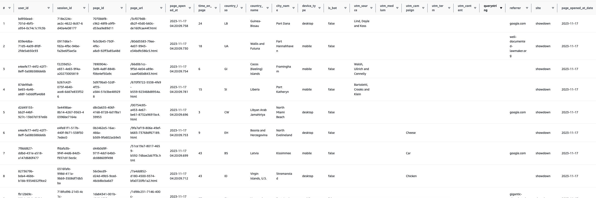

# Amazon Athena vs Amazon Timestream

This repo contains the code to reproduce the results of comparing Athena and Timestream query times. 

## Setup

**Prerequisites**
- AWS Account that has been bootstrapped with the AWS CDK

``` 
npm install
```

## Creating the infrastructure

Replacements:
- Change the `--profile <profile>` with the AWS profile you want to use in the `package.json` file.
- Change the AWS region and account with `stacks/index.json` file.
```ts
  const env = {
    region: "eu-west-1",
    account: "12344567890", 
  };
```

Now deploy with the CDK
```
npm run diff
npm run deploy
```

## Inserting the data

The `index.ts` file will insert data into Athena and Timestream, synchronously. It is intended to run from your local
machine, we take the average of 10 runs to account for network latency variance. It takes about 5 minutes to insert 100k
records into both. This test does not test for ingestion latency and throughput, only query latency.
The script inserts 100k records by default, the `maxRows` can be adjusted to a higher value if desired (tests were with 1M).

Replacements:
- Change the `config` variable in the `index.ts` file to match your deployed resources.

``` 
const config = {
  AWS_PROFILE: "systanics-prod-exported",
  AWS_REGION: "eu-west-1",
  ATHENA_FIREHOSE_NAME: "showdown-athena-analytic-page-views-firehose",
  ATHENA_GLUE_DB_NAME: "showdown-athena-db",
  ATHENA_S3_BUCKET_NAME: "showdown-athena-bucket-analytics",
  TIMESTREAM_DATABASE_NAME: "showdown-timestream-ts-db",
  TIMESTREAM_TABLE_NAME: "showdown-timestream-ts-table",
} as const;
```

Ensure the line to insert data is uncommented at the bottom of the `index.ts` file.
```
...
async function main()
{
  await loadData();
  await measureQueryPerformance();
}
```


## Querying the data

A few things to note:
- We are primarily interested in comparing Athena against Timestream's memory store, which is set to 3 hours as per CDK code.
  Therefor do these queries as soon as the data finished inserting.
- We do nothing with the returned data, I manually verified the results to be the same. We only measure the query AND retrieval times.
- Querying Athena is a 3 step process, first we submit the query, then we poll for the results every 50ms and lastly we retrieve the results.
- Querying Timestream is a 1 step process, we submit the query and get the results in the same call.
- We are only returning 1k rows from both, this is to avoid pagination. Seeing how long it takes to page the data out is beyond the scope of this test.
- We run the query 10 times and take the average, this is to account for network latency variance.
- Athena has partitioning enabled on site and page_opened_at_date. 
- We are querying 1 Million records in both Athena and Timestream.
- Example of date being queried: 


Average query times(ms) for 1M records:
```
| Query               | Athena | Timestream Memory | Timestream Magnetic |
|---------------------|--------|-------------------|---------------------|
| Count all           | 1628   | 1914              | 1019                |
| Count page_view     | 1573   | 1606              | 874                 |
| Page views & stats  | 2281   | 2535              | 1652                |
| First 1k rows       | 2811   | 3177              | 2876                |
```

## Conclusion

Athena is faster than the Timestream Memory store, but not by much. Timestream Magnetic store surprises by being 
faster than both. This is most likely because the memory store can be "flushed" to the magnetic store and write the 
data in an efficient way like parquet or avro.

---------

## Apendix - CLI output from running queries

### Athena vs Timestream Memory Store

#### Count all
```
Athena:
    SELECT COUNT(*) as "count" FROM page_views
    WHERE site = 'showdown' AND page_opened_at_date = '2023-11-17'
    AND page_opened_at BETWEEN now() - interval '3' hour AND now()

Timestream:
    SELECT COUNT(*) as "count" FROM "showdown-timestream-ts-db"."showdown-timestream-ts-table"
    WHERE time between ago(3h) and now() and site = 'showdown'
```
```
┌────────────┬──────┬──────┬──────┬────────┬──────────────────────────────────────────────────────────────┐
│  (index)   │ min  │ max  │ avg  │ stdDev │                           requests                           │
├────────────┼──────┼──────┼──────┼────────┼──────────────────────────────────────────────────────────────┤
│   Athena   │ 1295 │ 2127 │ 1628 │  253   │ '2127, 1813, 1343, 1838, 1514, 1350, 1295, 1778, 1672, 1547' │
│ TimeStream │ 1476 │ 4613 │ 1914 │  908   │ '4613, 1580, 1619, 1683, 1586, 1549, 1932, 1476, 1604, 1497' │
└────────────┴──────┴──────┴──────┴────────┴──────────────────────────────────────────────────────────────┘
```
- Athena: 1628ms ✅
- TimeStream: 1914ms

#### Count page_view
```
Athena:
    SELECT COUNT(page_id) as "count" FROM page_views
    WHERE site = 'showdown' AND page_opened_at_date = '2023-11-17'
    AND page_opened_at BETWEEN now() - interval '3' hour AND now()

Timestream:
    SELECT COUNT(page_id) as "count" FROM "showdown-timestream-ts-db"."showdown-timestream-ts-table"
    WHERE time between ago(3h) and now() and site = 'showdown'
```
```
┌────────────┬──────┬──────┬──────┬────────┬──────────────────────────────────────────────────────────────┐
│  (index)   │ min  │ max  │ avg  │ stdDev │                           requests                           │
├────────────┼──────┼──────┼──────┼────────┼──────────────────────────────────────────────────────────────┤
│   Athena   │ 1275 │ 2057 │ 1573 │  213   │ '2057, 1544, 1558, 1798, 1275, 1559, 1299, 1575, 1538, 1530' │
│ TimeStream │ 1566 │ 1715 │ 1606 │   42   │ '1609, 1576, 1715, 1585, 1566, 1596, 1612, 1597, 1635, 1567' │
└────────────┴──────┴──────┴──────┴────────┴──────────────────────────────────────────────────────────────┘
```
- Athena: 1573ms ✅
- TimeStream: 1606ms

#### Page views & stats
```
Athena:
    SELECT
        site,
        page_url,
        COUNT(*) as "views",
        ROUND(AVG(time_on_page),2) as "avg_time_on_page"
    FROM page_views
    WHERE site = 'showdown' AND page_opened_at_date = '2023-11-17'
    AND page_opened_at BETWEEN now() - interval '3' hour AND now()
    GROUP BY site, page_url
    ORDER BY views DESC, page_url ASC
    LIMIT 1000

Timestream:
    SELECT
        site,
        page_url,
        COUNT(*) as "views",
        ROUND(AVG(measure_value::double),2) as "avg_time_on_page"
    FROM "showdown-timestream-ts-db"."showdown-timestream-ts-table"
    WHERE time between ago(3h) and now() and site = 'showdown'
    GROUP BY site, page_url
    ORDER BY views DESC, page_url ASC
    LIMIT 1000
```
```
┌────────────┬──────┬──────┬──────┬────────┬──────────────────────────────────────────────────────────────┐
│  (index)   │ min  │ max  │ avg  │ stdDev │                           requests                           │
├────────────┼──────┼──────┼──────┼────────┼──────────────────────────────────────────────────────────────┤
│   Athena   │ 1847 │ 3429 │ 2281 │  413   │ '3429, 2289, 2124, 2413, 2071, 2064, 2354, 2115, 1847, 2107' │
│ TimeStream │ 2299 │ 2671 │ 2535 │  113   │ '2550, 2660, 2590, 2524, 2575, 2361, 2671, 2551, 2572, 2299' │
└────────────┴──────┴──────┴──────┴────────┴──────────────────────────────────────────────────────────────┘
```
- Athena: 2281ms ✅
- TimeStream: 2535ms

#### First 1k rows
```
Athena:
    SELECT *
    FROM page_views
    WHERE site = 'showdown' AND page_opened_at_date = '2023-11-17'
    AND page_opened_at BETWEEN now() - interval '3' hour AND now()
    ORDER BY page_opened_at DESC
    LIMIT 1000

Timestream:
    SELECT *
    FROM "showdown-timestream-ts-db"."showdown-timestream-ts-table"
    WHERE time between ago(3h) and now() and site = 'showdown'
    ORDER BY time DESC
    LIMIT 1000
```
```
┌────────────┬──────┬──────┬──────┬────────┬──────────────────────────────────────────────────────────────┐
│  (index)   │ min  │ max  │ avg  │ stdDev │                           requests                           │
├────────────┼──────┼──────┼──────┼────────┼──────────────────────────────────────────────────────────────┤
│   Athena   │ 2099 │ 4516 │ 2811 │  643   │ '2358, 2723, 3255, 4516, 2613, 2099, 2416, 2580, 2949, 2602' │
│ TimeStream │ 3034 │ 3467 │ 3177 │  147   │ '3174, 3146, 3454, 3090, 3086, 3147, 3467, 3112, 3059, 3034' │
└────────────┴──────┴──────┴──────┴────────┴──────────────────────────────────────────────────────────────┘
```
- Athena: 2811ms ✅
- TimeStream: 3177ms


### Athena vs Timestream Magnetic Store

#### Count all

``` 
Athena:
    SELECT COUNT(*) as "count" FROM page_views
    WHERE site = 'showdown' AND page_opened_at_date = '2023-11-17'
    AND page_opened_at BETWEEN now() - interval '12' hour AND now()

Timestream:
    SELECT COUNT(*) as "count" FROM "showdown-timestream-ts-db"."showdown-timestream-ts-table"
    WHERE time between ago(12h) and now() and site = 'showdown'
```

```
┌────────────┬──────┬──────┬──────┬────────┬──────────────────────────────────────────────────────────────┐
│  (index)   │ min  │ max  │ avg  │ stdDev │                           requests                           │
├────────────┼──────┼──────┼──────┼────────┼──────────────────────────────────────────────────────────────┤
│   Athena   │ 1305 │ 2318 │ 1767 │  350   │ '2110, 1586, 1329, 2318, 1580, 2301, 1781, 1801, 1305, 1556' │
│ TimeStream │ 798  │ 2517 │ 1019 │  501   │     '2517, 918, 858, 824, 824, 856, 798, 904, 850, 837'      │
└────────────┴──────┴──────┴──────┴────────┴──────────────────────────────────────────────────────────────┘
```
- Athena: 1767ms
- TimeStream: 1019ms ✅

#### Count page_view

``` 
Athena:
    SELECT COUNT(page_id) as "count" FROM page_views
    WHERE site = 'showdown' AND page_opened_at_date = '2023-11-17'
    AND page_opened_at BETWEEN now() - interval '12' hour AND now()

Timestream:
    SELECT COUNT(page_id) as "count" FROM "showdown-timestream-ts-db"."showdown-timestream-ts-table"
    WHERE time between ago(12h) and now() and site = 'showdown'
```

```
┌────────────┬──────┬──────┬──────┬────────┬──────────────────────────────────────────────────────────────┐
│  (index)   │ min  │ max  │ avg  │ stdDev │                           requests                           │
├────────────┼──────┼──────┼──────┼────────┼──────────────────────────────────────────────────────────────┤
│   Athena   │ 1282 │ 2118 │ 1584 │  284   │ '1285, 1545, 2090, 2118, 1305, 1551, 1551, 1559, 1282, 1551' │
│ TimeStream │ 822  │ 928  │ 874  │   34   │      '890, 883, 822, 892, 924, 839, 874, 851, 928, 840'      │
└────────────┴──────┴──────┴──────┴────────┴──────────────────────────────────────────────────────────────┘
```
- Athena: 1584ms
- TimeStream: 874ms ✅

#### Page views & stats
```
Athena:
    SELECT
        site,
        page_url,
        COUNT(*) as "views",
        ROUND(AVG(time_on_page),2) as "avg_time_on_page"
    FROM page_views
    WHERE site = 'showdown' AND page_opened_at_date = '2023-11-17'
    AND page_opened_at BETWEEN now() - interval '12' hour AND now()
    GROUP BY site, page_url
    ORDER BY views DESC, page_url ASC
    LIMIT 1000

Timestream:
    SELECT
        site,
        page_url,
        COUNT(*) as "views",
        ROUND(AVG(measure_value::double),2) as "avg_time_on_page"
    FROM "showdown-timestream-ts-db"."showdown-timestream-ts-table"
    WHERE time between ago(12h) and now() and site = 'showdown'
    GROUP BY site, page_url
    ORDER BY views DESC, page_url ASC
    LIMIT 1000

```

```
┌────────────┬──────┬──────┬──────┬────────┬──────────────────────────────────────────────────────────────┐
│  (index)   │ min  │ max  │ avg  │ stdDev │                           requests                           │
├────────────┼──────┼──────┼──────┼────────┼──────────────────────────────────────────────────────────────┤
│   Athena   │ 1832 │ 3236 │ 2296 │  366   │ '3236, 2112, 2579, 1832, 2145, 2084, 2154, 2109, 2372, 2337' │
│ TimeStream │ 1597 │ 1804 │ 1652 │   59   │ '1643, 1704, 1658, 1628, 1804, 1624, 1604, 1609, 1597, 1653' │
└────────────┴──────┴──────┴──────┴────────┴──────────────────────────────────────────────────────────────┘
```
- Athena: 2296ms
- TimeStream: 1652ms ✅

#### First 1k rows
```
Athena:
    SELECT *
    FROM page_views
    WHERE site = 'showdown' AND page_opened_at_date = '2023-11-17'
    AND page_opened_at BETWEEN now() - interval '12' hour AND now()
    ORDER BY page_opened_at DESC
    LIMIT 1000

Timestream:
    SELECT *
    FROM "showdown-timestream-ts-db"."showdown-timestream-ts-table"
    WHERE time between ago(12h) and now() and site = 'showdown'
    ORDER BY time DESC
    LIMIT 1000
```

``` 
┌────────────┬──────┬──────┬──────┬────────┬──────────────────────────────────────────────────────────────┐
│  (index)   │ min  │ max  │ avg  │ stdDev │                           requests                           │
├────────────┼──────┼──────┼──────┼────────┼──────────────────────────────────────────────────────────────┤
│   Athena   │ 2128 │ 3896 │ 2883 │  522   │ '2487, 3896, 3343, 3208, 2698, 2128, 2390, 2996, 3265, 2416' │
│ TimeStream │ 2728 │ 3058 │ 2876 │   88   │ '2933, 2921, 2849, 2772, 2902, 2910, 2862, 2823, 3058, 2728' │
└────────────┴──────┴──────┴──────┴────────┴──────────────────────────────────────────────────────────────┘
```
- Athena: 2883ms 
- TimeStream: 2876ms ✅
